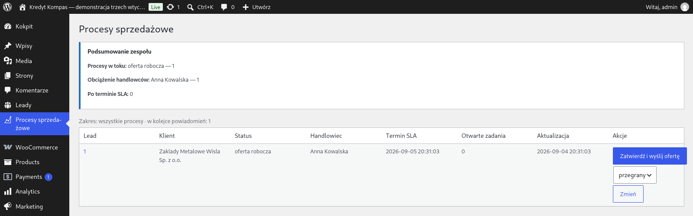

<div align="center">

# MP Offer Automation Suite

**From enquiry form to a finished PDF offer — with no manual data entry.**
Three WordPress/WooCommerce plugins, each owning its own tables: lead intake and
qualification → price calculation and PDF offer → sales process for the rep.

[▶ Launch the demo](https://playground.wordpress.net/?blueprint-url=https://raw.githubusercontent.com/krzysiek2115op/mp-offer-automation-suite/main/tools/strona-pokazowa/blueprint.json) ·
[Changelog](CHANGELOG.md) ·
[Project audit](docs/AUDYT.md) ·
[Releases](https://github.com/krzysiek2115op/mp-offer-automation-suite/releases) ·
[GPL-2.0+ licence](LICENSE) ·
[Polski](README.md)

<br>

[](https://playground.wordpress.net/?blueprint-url=https://raw.githubusercontent.com/krzysiek2115op/mp-offer-automation-suite/main/tools/strona-pokazowa/blueprint.json)

*One click boots a complete WordPress install with all three plugins and one full
run of the process. Nothing to install — WordPress runs inside your browser via
WebAssembly, and the data disappears when you close the tab.*

<sub>The demo runs on a **fictional client site, „Kredyt Kompas"** — the theme and
its content are part of the presentation, not the product. The point is to show the
plugins where they actually work: inside an existing company website. The same
fictional brand appears in a separate project,
[`kredyt-kompas-demo`](https://github.com/krzysiek2115op/kredyt-kompas-demo).</sub>


</div>

---

## The problem

Enquiries arrived through a web form. Everything after that was manual: someone retyped the
data into a spreadsheet, calculated the price against a rate card, built the offer in a word
processor, exported it to PDF, emailed it — and then tried to remember to follow up.

Three costly consequences: slow response times, pricing errors, and leads quietly forgotten.

## The solution

| # | Plugin | Version | Database | Responsibility |
|---|---|---|---|---|
| 1 | `mp-lead-intake` | 1.3.14 | own tables | Enquiry intake, validation, bot protection, VAT status check |
| 2 | `mp-offer-builder` | 1.3.12 | own tables | Price calculation from WooCommerce, discount rules, PDF generation |
| 3 | `mp-sales-workflow` | 1.3.14 | own tables | Owner assignment, SLA tracking, notifications, follow-ups |

Install order matters: **1, then 2, then 3**. Plugin 2 listens for events from plugin 1;
plugin 3 listens for events from both. Ready-to-install packages are in
[Releases](https://github.com/krzysiek2115op/mp-offer-automation-suite/releases).

## The decision that mattered most

**The plugins do not know about each other.** They communicate exclusively through WordPress
events — four hooks define the entire path of an enquiry:

```
form → [1] → mp_lead_created  → [2] draft offer
              mp_lead_verified → [2] VAT status correction on the draft
        [2] → mp_offer_created  → [3] sales process
        [2] → mp_offer_approved → [3] send to client + follow-ups
```

No plugin references another's classes or tables, and each owns its own set of MySQL tables.

What this buys the client:

- **deploy one plugin, not three** — evaluate the offer module before committing to the rest
- **a failure in one module doesn't stop the others**
- **extending the process means a new plugin listening to a hook**, not a change to existing code

Each plugin documents its own hooks, filters and extension points in `mp-*/docs/HAKI.md`.
Renaming or changing the arguments of any of the four hooks above breaks compatibility and
requires a changelog entry on **every** side involved.

## Requirements

| | |
|---|---|
| WordPress | 6.0+; tested on 7.0 |
| PHP | 7.4 for plugins 1 and 3, **8.1 for plugin 2** (the bundled dompdf will not run lower) |
| WooCommerce | required by plugin 2 (`Requires Plugins: woocommerce`) |
| `wp-config.php` constants | `MP_SW_LINK_KEY` — without it plugin 3 deliberately suspends notifications; `MP_HASH_PEPPER` — hashing pepper |

On a server running PHP older than 8.1, WordPress **will not allow plugin 2 to activate**.
Plugins 1 and 3 install normally, so the process starts and stops at the offer step — which
is why the 8.1 requirement effectively applies to the whole delivery.

## Scale and quality

- 33,944 lines of production PHP across 160 files, plus 32,767 lines of tests across 101 files (excluding vendor)
- 304 commits on `main`, 72 semver releases and 168 tags, each release with a packaged ZIP
- CI on a PHP 7.4 + 8.3 matrix: syntax checks, PHPCS/WPCS, and a **process harness of
  7 scenarios and 110 invariants**
- separate security and regression test suites
- final testing against a live WordPress + WooCommerce install
- security: `$wpdb->prepare()` throughout, nonces, capability checks, peppered hashing,
  signed single-use links

## An honest note about testing

I wrote a custom audit tool for this project — 37 "agent + critic" pairs across three depth
levels, analysing project state from a `git worktree` rather than the working directory.

It exists because the first serious audit found **8 critical bugs in code that passed the
entire test suite**, including a 500 error when a form field arrived as an array, and a
critical accessibility violation. Full write-up: [`docs/AUDYT.md`](docs/AUDYT.md) (Polish).

A green test suite doesn't mean the code is correct. It means it passes the tests someone
thought to write. I now budget a separate verification pass into every delivery.

## Licence

GPL-2.0-or-later — see [LICENSE](LICENSE). Compatible with WordPress and WooCommerce,
so the plugins can be distributed alongside them with no extra conditions.

## Contributing

Workflow, versioning and commit conventions: [`CONTRIBUTING.md`](CONTRIBUTING.md) (Polish).
