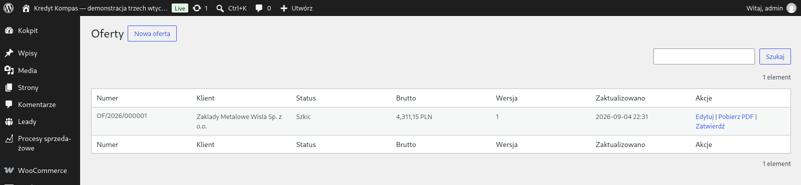
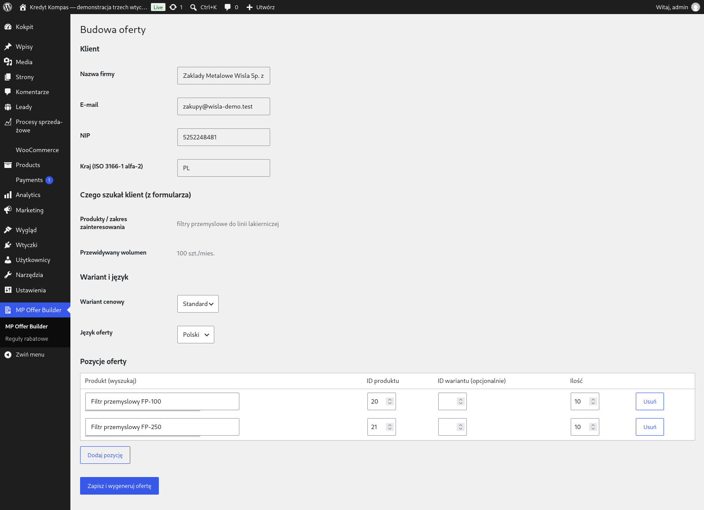

<div align="center">

# MP Offer Automation Suite

**Zapytanie ofertowe od formularza do gotowej oferty PDF — bez przepisywania danych.**
Pakiet trzech wtyczek WordPress/WooCommerce, każda z własnym zestawem tabel:
przyjęcie i kwalifikacja lead-a → kalkulacja i oferta PDF → proces sprzedaży
u handlowca.

[▶ Uruchom demo w przeglądarce](https://playground.wordpress.net/?blueprint-url=https://raw.githubusercontent.com/krzysiek2115op/mp-offer-automation-suite/main/tools/strona-pokazowa/blueprint.json) ·
[Dziennik zmian](CHANGELOG.md) ·
[Audyt projektu](docs/AUDYT.md) ·
[Wydania](https://github.com/krzysiek2115op/mp-offer-automation-suite/releases) ·
[Licencja GPL-2.0+](LICENSE) ·
[English](README.en.md)

<br>

[](https://playground.wordpress.net/?blueprint-url=https://raw.githubusercontent.com/krzysiek2115op/mp-offer-automation-suite/main/tools/strona-pokazowa/blueprint.json)

*Kliknięcie stawia kompletnego WordPressa z trzema wtyczkami i jednym pełnym
przebiegiem procesu. Nic nie trzeba instalować — WordPress uruchamia się
w Twojej przeglądarce (WebAssembly), a dane znikają po zamknięciu karty.*

<sub>Demo działa na **fikcyjnej witrynie klienta „Kredyt Kompas"** — motyw i treść
są częścią prezentacji, nie produktem. Chodzi o to, żeby pokazać wtyczki tam, gdzie
faktycznie pracują: w istniejącej stronie firmowej. Ta sama fikcyjna marka wraca
w osobnym projekcie [`kredyt-kompas-demo`](https://github.com/krzysiek2115op/kredyt-kompas-demo).</sub>


</div>

---

<details>
<summary><b>Spis treści</b></summary>

- [Stan projektu](#stan-projektu)
- [Co to rozwiązuje](#co-to-rozwiązuje)
- [Jak to wygląda](#jak-to-wygląda)
- [Wtyczki](#wtyczki)
- [Struktura repozytorium](#struktura-repozytorium)
- [Workflow](#workflow)
- [CI](#ci)
- [Audyt projektu](#audyt-projektu)
- [Licencja](#licencja)

</details>

## Stan projektu

| | |
|---|---|
| **Wersje wtyczek** | `mp-lead-intake` **1.3.14** · `mp-offer-builder` **1.3.12** · `mp-sales-workflow` **1.3.14** |
| **Etap** | Trzy wtyczki skończone i wydane. Kod produkcyjny + testy scalone na `main` |
| **Rozmiar** | **66 711 linii PHP w 261 plikach** — 33 944 produkcja (160 plików), 32 767 testy (101 plików) |
| **Wydania** | **72** · **168 tagów** · **304 commity** na `main` |
| **Demo** | [WordPress Playground](https://playground.wordpress.net/?blueprint-url=https://raw.githubusercontent.com/krzysiek2115op/mp-offer-automation-suite/main/tools/strona-pokazowa/blueprint.json) — działa bez instalacji |
| **Gałąź domyślna** | `main` — źródło prawdy. Gałęzie wtyczek zostają jako zapis historii |
| **Licencja** | GPL-2.0-or-later ([LICENSE](LICENSE)) — zgodna z WordPressem i WooCommerce |

<sub>Liczby zmierzone, nie przepisane: `git rev-list --count main`,
`git ls-remote --tags origin`, `gh api --paginate .../releases`,
`find mp-* -name '*.php' -not -path '*/vendor/*' | xargs cat | wc -l`.</sub>

## Co to rozwiązuje

Firma dostaje zapytanie ofertowe mailem albo formularzem. Ktoś przepisuje dane
do arkusza, ktoś inny liczy cenę, ktoś trzeci składa PDF i pilnuje, żeby handlowiec
oddzwonił. Każdy z tych kroków to miejsce, w którym zapytanie potrafi utknąć.

Ten pakiet prowadzi zapytanie automatycznie przez pięć kroków:

1. **kwalifikacja lead-a** z formularza (walidacja NIP przez VIES, Biała lista MF),
2. **karta klienta** w bazie,
3. **wariant cenowy** dobrany regułami rabatowymi,
4. **oferta PDF** wygenerowana z pozycji,
5. **zadanie u właściwego handlowca** z terminem SLA i follow-upami.

Efekt: spójny przepływ **formularz → oferta**, bez ręcznego przenoszenia danych
między formularzem, WooCommerce i pocztą.

## Jak to wygląda

Zrzuty z **działającego demo**, nie z makiety — każdy da się odtworzyć jednym
kliknięciem w link wyżej.

| | |
|---|---|
| [](docs/zrzuty/03-oferty.png) | **Oferty** — dokument `OF/2026/000001`, klient, brutto 4 311,15 PLN, akcje *Edytuj / Pobierz PDF / Zatwierdź* |
| [](docs/zrzuty/05-kalkulacja-oferty.png) | **Kalkulacja** — pozycje, ilości, reguły rabatowe i wyliczenie przed wysłaniem. Handlowiec może poprawić ofertę, zanim ją zatwierdzi |

Panel procesów sprzedażowych jest na zrzucie u góry tego pliku.

## Wtyczki

| # | Wtyczka | Wersja | Baza | Opis |
|---|---------|--------|------|------|
| 1 | `mp-lead-intake` | 1.3.14 | BD-3 | Przyjęcie i kwalifikacja lead-a z formularza |
| 2 | `mp-offer-builder` | 1.3.12 | BD-2 | Kalkulacja cenowa, integracja WooCommerce, oferty PDF |
| 3 | `mp-sales-workflow` | 1.3.14 | BD-1 | Statusy procesu, handlowiec, powiadomienia, follow-up, dashboard |

Kolejność instalacji ma znaczenie: **1, potem 2, potem 3**. Wtyczka 2 nasłuchuje
zdarzenia z wtyczki 1, a wtyczka 3 — zdarzeń z obu poprzednich. Gotowe paczki
do wgrania są w [Releases](https://github.com/krzysiek2115op/mp-offer-automation-suite/releases).

### Wymagania

| | |
|---|---|
| WordPress | 6.0 lub nowszy; testowane na 7.0 |
| PHP | 7.4 dla wtyczek 1 i 3, **8.1 dla wtyczki 2** (dołączony dompdf nie działa niżej) |
| WooCommerce | wymagany przez wtyczkę 2 (`Requires Plugins: woocommerce`) |
| Stałe w `wp-config.php` | `MP_SW_LINK_KEY` — bez niej wtyczka 3 celowo wstrzymuje wysyłkę powiadomień; `MP_HASH_PEPPER` — pieprz do hashowania |

Na serwerze z PHP starszym niż 8.1 WordPress **nie pozwoli aktywować wtyczki 2**.
Wtyczki 1 i 3 zainstalują się normalnie, więc proces ruszy i zatrzyma się na
kroku ofert — dlatego wymaganie 8.1 dotyczy w praktyce całej dostawy.

### Styki między wtyczkami

Wtyczki nie znają swoich klas ani tabel — rozmawiają wyłącznie zdarzeniami
WordPressa. Cztery haki wyznaczają całą drogę zapytania:

```
formularz → [1] → mp_lead_created  → [2] szkic oferty
                  mp_lead_verified → [2] poprawka statusu VAT w szkicu
            [2] → mp_offer_created  → [3] proces sprzedaży
            [2] → mp_offer_approved → [3] wysyłka do klienta + follow-upy
```

Komplet haków każdej wtyczki — razem z filtrami i punktami rozszerzeń dla
integratora — opisuje `mp-*/docs/HAKI.md`. Zmiana nazwy albo argumentów
któregokolwiek z czterech powyższych łamie zgodność i wymaga wpisu
w changelogu **wszystkich** stron, których dotyczy.

## Struktura repozytorium

```
mp-lead-intake/        wtyczka 1 (BD-3)
mp-offer-builder/      wtyczka 2 (BD-2), z vendor/ — dompdf
mp-sales-workflow/     wtyczka 3 (BD-1)
paczka-klienta/        materiały dla klienta, osobny komplet na wtyczkę
  ├─ mp-lead-intake/materialy/
  ├─ mp-offer-builder/materialy/
  └─ mp-sales-workflow/materialy/
raporty/               zapisy z przebiegów testów
tools/                 narzędzia deweloperskie (m.in. środowisko testowe)
docs/AUDYT.md          własne narzędzie audytujące — opis i ustalenia
docs/zrzuty/           zrzuty z działającego demo
CHANGELOG.md           dziennik zmian — wydania 1.3.7 i nowsze
CONTRIBUTING.md        workflow, wersjonowanie, konwencja commitów
.github/workflows/     CI — trzy wtyczki na PHP 7.4 i 8.3
.github/dependabot.yml aktualizacje Composera i akcji GitHuba
.phpcs.xml.dist        wspólne reguły PHPCS/WPCS dla trzech wtyczek
composer.json          narzędzia deweloperskie (PHPCS/WPCS) — NIE zależności wtyczek
LICENSE                GPL-2.0-or-later
```

Każda wtyczka mieszka we własnym katalogu w korzeniu repo, zgodnie z konwencją
wtyczek WordPress. Powstawały na osobnych gałęziach (`mp-lead-intake`,
`mp-offer-builder`, `mp-sales-workflow`) i te gałęzie nadal istnieją jako zapis
historii — ale od scalenia **źródłem prawdy jest `main`** i to on zawiera komplet.

Narzędzie audytujące żyje osobno, na gałęzi `audyt-projektu`: nie jest wtyczką
WordPressa i nie trafia do klienta, więc świadomie nie ma go w `main`.

## Workflow

- Każda wtyczka ma dedykowany branch (`mp-lead-intake`, `mp-offer-builder`,
  `mp-sales-workflow`). Branche powstały jako
  **w pełni odizolowane** — własny `composer.json` i `.phpcs.xml.dist`, bez
  dziedziczenia kodu między nimi. Dzięki temu kod trzech wtyczek nie kolidował
  ze sobą przy scalaniu do `main` ani w jednym pliku.
- `main` zbiera komplet. Pliki konfiguracyjne korzenia są tam **sumą** trzech
  wersji: `.phpcs.xml.dist` skanuje trzy katalogi i zna trzy text domains,
  `composer.json` opisuje wspólne narzędzia deweloperskie.
- Narzędzie audytujące mieszka na osobnym branchu `audyt-projektu` — nie jest
  częścią dostawy dla klienta.
- Commity powstają automatycznie przy każdym większym kroku.

## CI


Przy każdym push/PR na `main` (oraz na gałęzie wtyczek) GitHub Actions
(`.github/workflows/ci.yml`) uruchamia na PHP 7.4 i 8.3:

1. `php -l` — składnia **wszystkich trzech wtyczek**, bez `vendor/`,
2. PHPCS/WPCS wg wspólnych reguł z korzenia repo (`.phpcs.xml.dist`),
3. `tests/process-harness/run-process.php` wtyczki 1 — 7 scenariuszy + niezmienniki,
4. `tests/process-harness/run-process.php` wtyczki 2 — 110 niezmienników procesu.

Testy wtyczki 3 oraz testy końcowe wtyczek 1 i 2 wymagają **żywego WordPressa
z WooCommerce** (`wp eval-file`), więc nie są częścią CI — uruchamia się je
w środowisku opisanym w [tools/test-env/README.md](tools/test-env/README.md).

Zależności narzędzi dev (PHPCS/WPCS) są w `composer.json`/`composer.lock` w korzeniu
repo — wspólne dla wszystkich 3 wtyczek/branchy, nie duplikowane per plugin.

## Audyt projektu

Audyt końcowy z 29.07.2026 wykazał **8 błędów krytycznych** w kodzie, który
przechodził komplet testów końcowych. Test potwierdza to, co autorowi przyszło
do głowy sprawdzić — i nic ponadto. Dlatego w projekcie powstało **własne
narzędzie audytujące**: 37 par „agent + krytyk", trzy głębokości przebiegu,
`git worktree` na stanie z repozytorium zamiast na tym, co leży na dysku.

Ustalenie, którego dział re-audytu nie potwierdzi drugą metodą, nie trafia do
raportu jako fakt — dostaje status hipotezy razem z uzasadnieniem obu stron.

**Wniosek wart zapamiętania bardziej niż sam werdykt: „GO" znaczy „nie wróciło
nic, co już znamy" — a nie „nie ma błędów".**

👉 Pełny opis narzędzia, trzy głębokości, rejestr 38 błędów i historia ustaleń:
**[`docs/AUDYT.md`](docs/AUDYT.md)**

## Licencja

Cała automatyzacja — wszystkie trzy wtyczki wraz z materiałami klienckimi
(diagramy, schematy baz danych, instrukcje) — jest wydana na licencji
**GNU General Public License v2.0 lub późniejszej** (GPL-2.0-or-later).

Pełny tekst licencji: plik [LICENSE](LICENSE) w korzeniu repozytorium oraz
kopia w katalogu każdej wtyczki. Wersja online:
<https://www.gnu.org/licenses/gpl-2.0.html>.

Copyright (C) 2026 krzysiek2115op

Ten program jest wolnym oprogramowaniem: możesz go rozprowadzać dalej i/lub
modyfikować na warunkach GNU GPL wydanej przez Free Software Foundation —
w wersji 2 licencji lub (według twojego wyboru) dowolnej późniejszej.
Program rozpowszechniany jest w nadziei, że będzie użyteczny, ale **BEZ
JAKIEJKOLWIEK GWARANCJI**, nawet domyślnej gwarancji PRZYDATNOŚCI HANDLOWEJ
albo PRZYDATNOŚCI DO OKREŚLONYCH ZASTOSOWAŃ. Szczegóły w treści licencji.

GPL-2.0 jest zgodna z licencją samego WordPressa i WooCommerce, więc wtyczki
można rozpowszechniać razem z nimi bez dodatkowych warunków.

### Biblioteki zewnętrzne dołączone do wtyczki 2

Wtyczka `mp-offer-builder` zawiera w katalogu `vendor/` biblioteki potrzebne
do generowania PDF. Każda zachowuje własną licencję:

| Biblioteka | Licencja |
|---|---|
| `dompdf/dompdf` | LGPL-2.1 |
| `dompdf/php-font-lib` | LGPL-2.1-or-later |
| `dompdf/php-svg-lib` | LGPL-3.0-or-later |
| `masterminds/html5` | MIT |
| `sabberworm/php-css-parser` | MIT |
| `thecodingmachine/safe` | MIT |

**Dlaczego „lub późniejsza" ma tu znaczenie:** `php-svg-lib` jest na LGPL-3.0,
która jest zgodna z GPL-3.0, ale nie z samą GPL-2.0. Ponieważ wtyczki są wydane
jako GPL-2.0-**or-later**, odbiorca może przyjąć warunki GPL-3.0 i wtedy całość
jest spójna prawnie. Gdyby licencja była „GPL-2.0 only", tej biblioteki nie dałoby
się dołączyć zgodnie z prawem.
